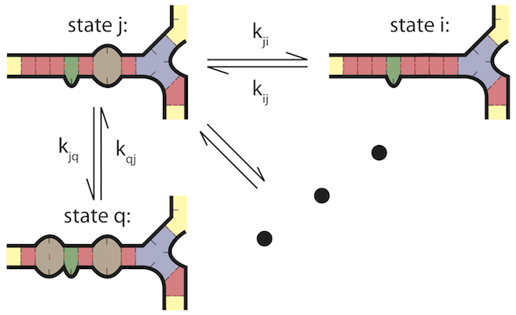

# About

        ___  ___      _ _   _     _                       _ 
        |  \/  |     | | | (_)   | |                     | |
        | .  . |_   _| | |_ _ ___| |_ _ __ __ _ _ __   __| |
        | |\/| | | | | | __| / __| __| '__/ _` | '_ \ / _` |
        | |  | | |_| | | |_| \__ \ |_| | | (_| | | | | (_| |
        \_|  |_/\__,_|_|\__|_|___/\__|_|  \__,_|_| |_|\__,_|


Multistrand is a software package for simulating the kinetics of multiple
interacting nucleic acid strands. It is implemented in C++ and provides a Python
API.

Key features:

- Simulates the kinetic behaviour of nucleic acids as continuous-time random
  walks over energy landscapes of secondary structures.
- Supports multiple interacting strands.
- Ensures equilibrium consistency with the thermodynamic model of
  [NUPACK](https://nupack.org/) 3.
- Includes various simulation modes for studying trajectory samples.

[Changelog](CHANGELOG.md) | [License](LICENSE)



## Contact
Please use GitHub issues for bug reports, feature requests etc., and send more
general inquiries or feedback to help@multistrand.org.

## Citations
If you use Multistrand in your research, please cite the following publications:

- Joseph M. Schaeffer (2013) *Stochastic simulation of the kinetics of multiple
  interacting nucleic acid strands*. Dissertation (Ph.D.), California Institute
  of Technology. https://thesis.library.caltech.edu/7460/
- Joseph M. Schaeffer, Chris Thachuk, Erik Winfree (2015) *Stochastic simulation
  of the kinetics of multiple interacting nucleic acid strands*. DNA Computing
  and Molecular Programming (DNA21), Lecture Notes in Computer Science (LNCS)
  volume 9211, pp 194-211. https://doi.org/10.1007/978-3-319-21999-8_13

## Contributors
Multistrand was developed by the [Winfree lab](
https://www.dna.caltech.edu/~winfree/) at the California Institute of
Technology, Pasadena. Until 2013, development was led by Joseph Schaeffer (now
Autodesk). The project is currently maintained by Boyan Beronov ([Condon lab](
https://www.cs.ubc.ca/~condon/), University of British Columbia, Vancouver) and
Jake Kaslewicz ([Riedel lab](
https://mriedel.ece.umn.edu/wiki/index.php/Marc_Riedel), University of
Minnesota, Minneapolis-Saint Paul).

* [Erik Winfree](winfree@caltech.edu)
* Chris Thachuk
* [Frits Dannenberg](fdann@caltech.edu)
* Chris Berlind
* Joshua Loving
* Justin Bois
* Joseph Berleant
* Joseph Schaeffer
* [Jake Kaslewicz](kasle001@umn.edu)
* [Boyan Beronov](beronov@cs.ubc.ca)


# Installation methods
## In an existing Python environment
First, make sure the following requirements are installed on your host system:
- C++11 (GCC 8+/Clang 8+/[MSVC](https://wiki.python.org/moin/WindowsCompilers) 14+)
- Python 3.10+
- [NUPACK](https://nupack.org/) 4.0.2+

Then, install Multistrand directly from GitHub, using a Python package manager
such as
[`pip`](https://packaging.python.org/en/latest/tutorials/installing-packages/#installing-from-vcs)
or [`uv`](https://docs.astral.sh/uv/concepts/projects/dependencies/#git).

## As a container
- [Install Apptainer](https://apptainer.org/docs/admin/latest/installation.html).
- `git clone` this repository.
- Download the release archive `nupack-<version>.zip` and place it into the
  parent directory of the Multistrand repository, where the container build
  script expects to find it.
- `$> cd tools`
- [Build the container](
  https://apptainer.org/docs/user/latest/build_a_container.html):
  `$> apptainer build multistrand.sif multistrand.def`.
- [Start the container](
  https://apptainer.org/docs/user/latest/quick_start.html#interacting-with-images):
  `$> apptainer shell [options...] --pwd /dna/multistrand multistrand.sif`.

## Testing
To execute the test suite, including some of the small tutorials:

- Install the [package extra](
  https://packaging.python.org/en/latest/specifications/dependency-specifiers/#extras)
  `[testing]`.
- Run: `$> pytest`


# Documentation
## API
For a listing of Multistrand's functionality, see the Python module
documentations:

```python
from multistrand import objects, options, system
help(objects)
help(options)
help(system)
```

## Tutorials
- [`tutorials/under_the_hood/`](tutorials/under_the_hood/): in-depth tutorials
  in the form of commented Python scripts.
- [`tutorials/under_the_hood_notebooks/`](tutorials/under_the_hood_notebooks/):
  corresponding Jupyter notebooks.
- [`tutorials/hybridization_casestudy/`](tutorials/hybridization_casestudy/): a
  case study into hybridization kinetics.
- [`tutorials/misc/`](tutorials/misc/): additional demos.

## Quick primer
### Hybridization trajectories
A basic test to see if Multistrand is working is to run the following script,
which simulates the hybridization of two complementary strands after their
initial collision, ending the simulation when the two strands either completely
hybridize or separate. Of the example trajectories below, the first dissociates
immediately, while the second hybridizes successfully.

```sh
$> python tutorials/misc/sample_trace.py
========================================================================
trajectory_seed = -5715420966438951381
------------------------------------------------------------------------
                        |   t[us]   | dG[kcal/mol] |     state_seed     
------------------------------------------------------------------------
    GTGAAACGC+GCGTTTCAC
[1] ....(....+.....)... | 0.0000000 |    +1.425    | (25464,59684,28716)
    GTGAAACGC GCGTTTCAC
[2] ......... ......... | 0.1576000 |    +0.000    | (25330,19709,56925)


========================================================================
trajectory_seed = 310526192
------------------------------------------------------------------------
                        |   t[us]   | dG[kcal/mol] |     state_seed     
------------------------------------------------------------------------
    GTGAAACGC+GCGTTTCAC
[1] ....(....+...)..... | 0.0000000 |    +1.673    | (25464,38385,34799)
[1] ...((....+...)).... | 0.0085160 |    +0.250    | (25330,12050,10454)
[1] ...((...(+)..)).... | 0.3560000 |    +3.517    | (61436,56661,54951)
[1] ...((.(.(+).))).... | 0.3684000 |    +3.050    | (11542,58957, 6710)
[1] ...((.(..+..))).... | 0.4023000 |    +1.474    | (16576,28120,15144)
[1] ...((....+...)).... | 0.4855000 |    +0.250    | (62842,23655,28351)
[1] ...((..(.+.).)).... | 0.5994000 |    -0.307    | (22980,24616,29487)
[1] ....(..(.+.).)..... | 0.9473000 |    +1.116    | (24606, 4540,60208)
[1] .......(.+.)....... | 0.9868000 |    +0.159    | (32520,22898,24482)
[1] ......((.+.))...... | 1.0410000 |    -3.396    | (20738,   26,22167)
[1] ......(((+)))...... | 1.1980000 |    -4.810    | (13452,28387,35652)
[1] ......((.+.))...... | 2.4110000 |    -3.396    | (60454, 5099,63309)
[1] ......(((+)))...... | 2.4260000 |    -4.810    | (15952,15723, 4840)
[1] .....((((+))))..... | 2.6690000 |    -5.362    | (38282,37785,32239)
[1] .....(((.+.)))..... | 3.0420000 |    -3.948    | (41044,14787,55621)
[1] ....((((.+.)))).... | 3.1200000 |    -5.215    | (61742, 6445,28286)
[1] ....(((((+))))).... | 3.2940000 |    -6.629    | (40600,31921,48515)
[1] ...((((((+))))))... | 3.3780000 |    -7.898    | (58130,  569,24364)
[1] ..(((((((+))))))).. | 3.9330000 |   -10.739    | (48412,36746,54017)
[1] .((((((((+)))))))). | 4.0400000 |    -9.787    | (36662,31224, 5118)
[1] ..(((((((+))))))).. | 5.1430000 |   -10.739    | (49120,64760,65291)
[1] ..((((((.+.)))))).. | 5.9350000 |    -9.325    | (22938,33203,29758)
[1] ..(((((((+))))))).. | 6.2090000 |   -10.739    | (43748,43517,36470)
[1] ..((.((((+)))).)).. | 6.3230000 |    -7.244    | (58942,39781, 5464)
[1] ..(((((((+))))))).. | 6.3960000 |   -10.739    | (49704,15159,13700)
[1] (.(((((((+))))))).) | 6.4170000 |    -7.986    | ( 6434,64162, 1081)
[1] (.((((((.+.)))))).) | 6.9630000 |    -6.571    | (35244, 2661,61576)
[1] ..((((((.+.)))))).. | 6.9790000 |    -9.325    | ( 5702,24500, 7381)
[1] ..(((((((+))))))).. | 7.2810000 |   -10.739    | (50544,28713,38771)
[1] .((((((((+)))))))). | 8.3340000 |    -9.787    | (16810,  262,36216)
[1] (((((((((+))))))))) | 8.7590000 |   -12.379    | (31092,26127,57927)
```

### Hybridization rates
The following script estimates the hybridization rate for a strand and its
complement. The computation relies on "first step mode" and will only work if
NUPACK is correctly installed. Alternatively, dissociation rates can be computed
by using `dissociation` as the first commandline argument. In that case, the
dissociation rate is computed indirectly by estimating the association rate, and
working out the dissociation rate from the partition function (e.g. `k_forward /
k_backward = exp(-dG / RT)` where `dG` is the partition function for the
complex, `R` is the gas constant and `T` is the temperature).

```sh
$> python tutorials/compute/rate.py hybridization AGCTGA -bootstrap
--------------------------------------------------------------------------------
2025-04-13 19:17:53   Starting Multistrand 2.2  (c) 2008-2025 Caltech

Running first step mode simulations for AGCTGA (with Boltzmann sampling)...

Start states:
Complex:
         Name: 'automatic0'
     Sequence: AGCTGA
    Structure: ......
      Strands: ['top']
    Boltzmann: True
  Supersample: 1

Complex:
         Name: 'automatic1'
     Sequence: TCAGCT
    Structure: ......
      Strands: ['top*']
    Boltzmann: True
  Supersample: 1

Stop conditions:
Stop Condition, tag:SUCCESS
  Sequence  0: AGCTGA+TCAGCT
  Structure 0: ((((((+))))))

Stop Condition, tag:FAILURE
  Sequence  0: AGCTGA
  Structure 0: ......

Using Results Type: FirstStepRate
Computing 1000 trials, using 10 threads ..
 .. and rolling 100 trajectories per thread until 500 successful trials occur.

nForward = 443
nReverse = 357

nForward = 546
nReverse = 454

Found 546 successful trials, terminating.
Done.  0.25239 seconds -- now processing results

The hybridization rate of AGCTGA and the reverse complement is 3.00e+06 /M /s
Bootstrapping FirstStepRate, using 1200 samples.    ..finished in 1.39 sec.

Estimated 95% confidence interval: [2.84e+06,3.16e+06]
Computing took 2.7906 s
```

### Log file
Multistrand automatically creates a log file that contains some information on
the used model, e.g.:

```
$> cat multistrandRun.log
--------------------------------------------------------------------------------
Multistrand 2.2

sodium        :  1 M
magnesium     :  0 M
temperature   :  298.15 K
rate method   :  3  (1: Metropolis, 2: Kawasaki, 3: Arrhenius)
dangles       :  1  (0: none, 1: some, 2: all)
GT pairing    :  1  (0: disabled, 1: enabled)
concentration :  1 M
Nupack params :  /opt/bitnami/python/lib/python3.12/site-packages/nupack/parameters/dna04-nupack3.json

Kinetic parameters:
  type          End        Loop       Stack  StackStack     LoopEnd    StackEnd   StackLoop
  A      1.2965e+01  1.6424e+01  1.4184e+01  8.0457e+00  2.4224e+00  1.7524e+01  5.8106e+00
  E      3.4980e+00  4.4614e+00  5.2869e+00 -6.2712e-01  8.4934e-02  2.6559e+00 -1.1276e+00
  R      1.3584e+06  5.3080e+07  3.7097e+04  8.0873e+07  9.5396e+01  2.1242e+11  5.0138e+06

        dS_A        dH_A     biScale        kUni
 -0.0000e+00 -0.0000e+00  1.6006e-02  1.0000e+00

Rate matrix [ concentration . k_bi . k_uni(l,r) ]:
  2.1742e+04  1.3591e+05  3.5931e+03  1.6777e+05  1.8221e+02  8.5980e+06  4.1772e+04
  1.3591e+05  8.4962e+05  2.2461e+04  1.0487e+06  1.1390e+03  5.3747e+07  2.6112e+05
  3.5931e+03  2.2461e+04  5.9378e+02  2.7724e+04  3.0111e+01  1.4209e+06  6.9031e+03
  1.6777e+05  1.0487e+06  2.7724e+04  1.2945e+06  1.4059e+03  6.6342e+07  3.2231e+05
  1.8221e+02  1.1390e+03  3.0111e+01  1.4059e+03  1.5269e+00  7.2053e+04  3.5006e+02
  8.5980e+06  5.3747e+07  1.4209e+06  6.6342e+07  7.2053e+04  3.4000e+09  1.6518e+07
  4.1772e+04  2.6112e+05  6.9031e+03  3.2231e+05  3.5006e+02  1.6518e+07  8.0252e+04
```


## Frequently asked questions
### Capabilities
**Q:** Can I simulate leak reactions using Multistrand?

**A:** Yes. We have now added a preliminary tutorial, see
[`tutorials/leak_casestudy/`](tutorials/leak_casestudy/).

### Troubleshooting
**Q:** How do I adjust the solvent salt concentrations?

**A:** Like so. (units are M = mol / litre)

```python
from multistrand.options import Options
o1 = Options()
o1.sodium = 0.05
o1.magnesium = 0.0125
```
